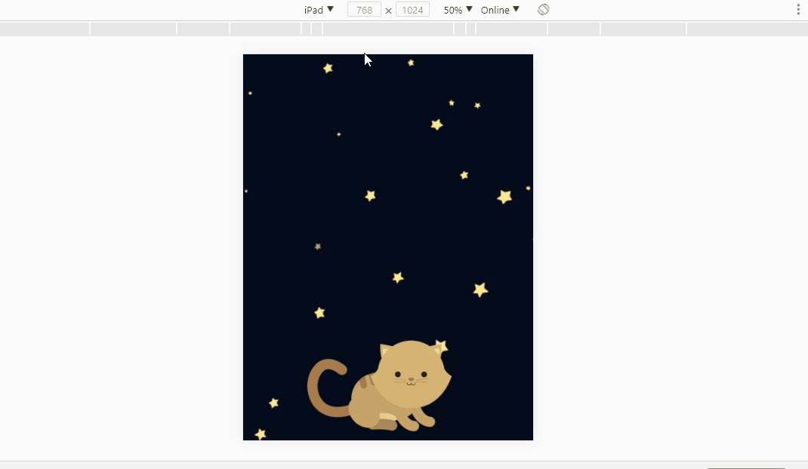

# Kitten

## Sprint 3 Laboratoria. Retos de código.

### Descripción:
Página web donde se muestra un paisaje y un gatito diferente a medida que la ventana del navegador se hace más pequeña.

- **HTML:** Se crea una caja contenedora por medio de un *div* (_class= "kittys-box"_) para la imagen del gatito, dentro de una etiqueta *img* donde se especifica la ruta de acceso a la imagen dentro de la estructura de carpetas.

- **CSS:** Se emplea el uso Media Queries que modifican la _background-image_ desde la etiqueta _body_ del documento _html_ e igualmente modifican el contenido de la _img_ del gatito. El gatito al estar dentro de un contenedor con márgenes relativos y con respecto a la altura del viewport (100vh), va modificando su tamaño.

--------------------------

## Resultado
Tanto el gatito como la imagen de fondo se adaptan de acuerdo al tamaño de la pantalla.

